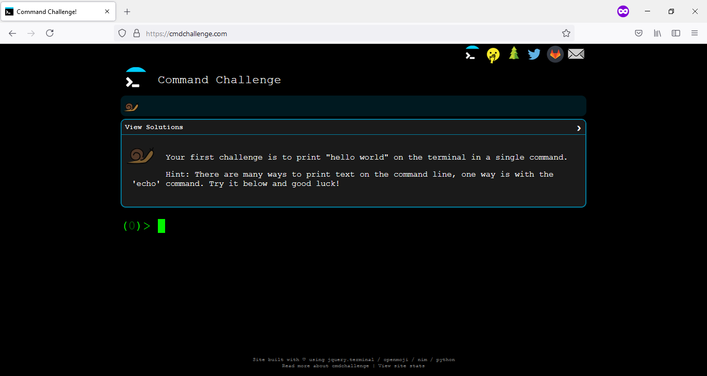

# Command line FTW!!
Welcome to the Command Line Challenge. This repository contains some snapshots proving my take on this challenge. If you like to learn the command line by doing, then I highly suggest you do this challenge. There's no standard way to solve this challenge though. The only thing that matters is that your command entered works.

Here's the link to the challenge: https://cmdchallenge.com/

Happy command line learning!!

# Author 

## 👤 Alfredo Delgado Moreno

  

